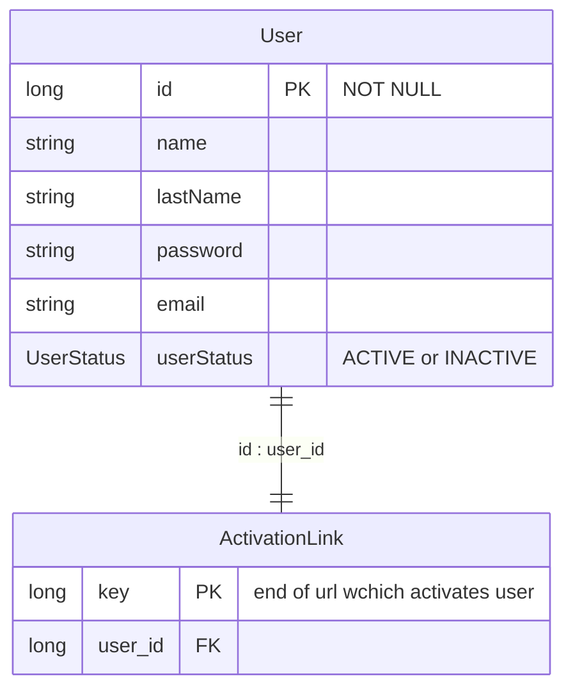
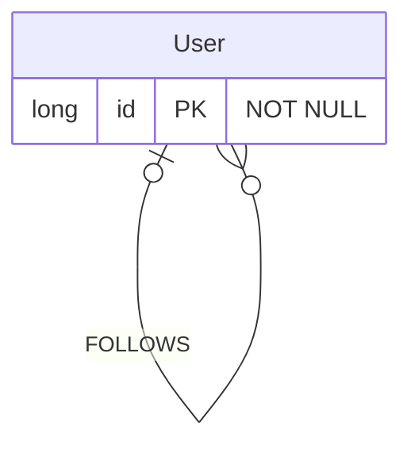
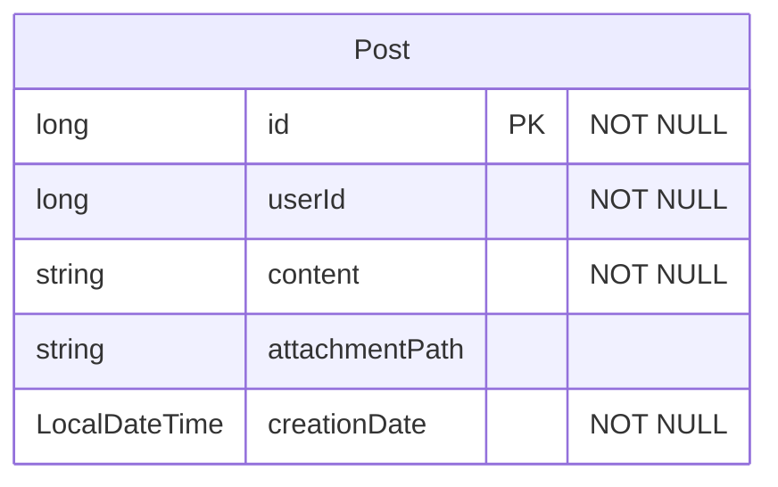
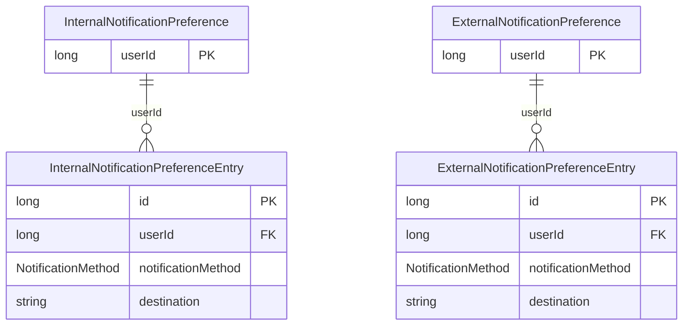
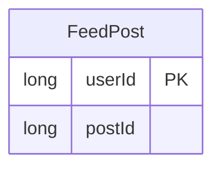
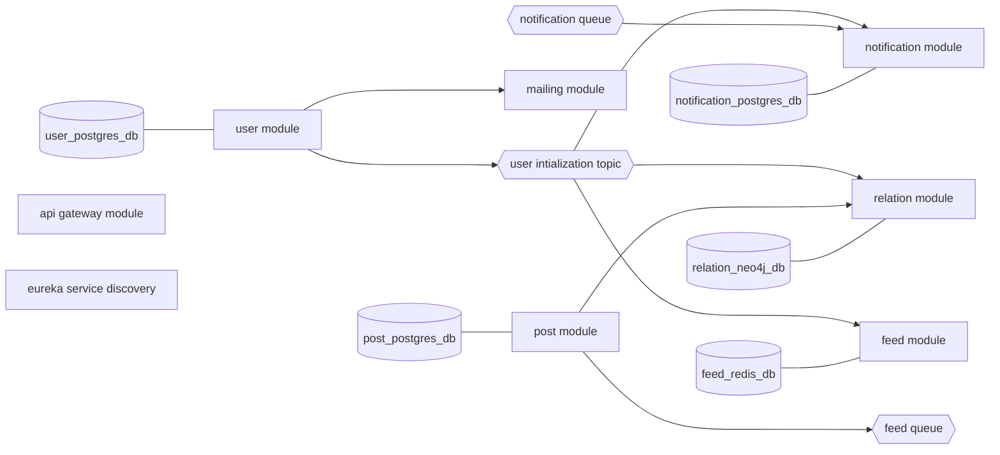

# User Module

```mermaid
erDiagram
    User{
        long id PK "NOT NULL"
        string name
        string lastName
        string password
        string email
        UserStatus userStatus "ACTIVE or INACTIVE"
    }
    
    ActivationLink{
        long key PK "end of url wchich activates user"
        long user_id FK
    }

    User ||--|| ActivationLink : "id : user_id"
```

# Relation Module

```mermaid
erDiagram
    User{
        long id PK "NOT NULL"
    }
    User |o--o{ User : FOLLOWS
```

# Post Module

```mermaid
erDiagram
    Post{
        long id PK "NOT NULL"
        long userId "NOT NULL"
        string content "NOT NULL"
        string attachmentPath
        LocalDateTime creationDate "NOT NULL"
    }
```

# Notification Module

```mermaid
erDiagram
    InternalNotificationPreference{
        long userId PK
     }
    InternalNotificationPreferenceEntry{
        long id PK
        long userId FK
        NotificationMethod notificationMethod
        string destination 
    }
    InternalNotificationPreference ||--o{ InternalNotificationPreferenceEntry: userId
    
    ExternalNotificationPreference{
        long userId PK
    }
    ExternalNotificationPreferenceEntry{
        long id PK
        long userId FK
        NotificationMethod notificationMethod
        string destination
    }    
    ExternalNotificationPreference ||--o{ ExternalNotificationPreferenceEntry: userId
 
```

# Feed Module

```mermaid
erDiagram
    FeedPost{
        long userId PK
        long postId
    }
```

# Module Relationships Overview

```mermaid
flowchart LR
    id1[(notification_postgres_db)]
    id2[(user_postgres_db)]
    id3[(relation_neo4j_db)]
    id4[(post_postgres_db)]
    id5[(feed_redis_db)]
    
    id6[user module]
    id8[notification module]
    id12[api gateway module]
    id9[feed module]
    id7[post module]
    id11[relation module]
    id10[mailing module]
    id13[eureka service discovery]
    
    id14{{feed queue}}
    id15{{notification queue}}
    id16{{user intialization topic}}
    
    id16 ---> id8
    id6 ---> id10
    id16 ---> id11
    id2 --- id6
    id16 ---> id9
    id6 ---> id16
  
    id7 ---> id11
    id7 ---> id14  
    
    id15 ---> id8
    
    
    id4 --- id7
    id1 --- id8
    id5 --- id9
    id3 --- id11
```
